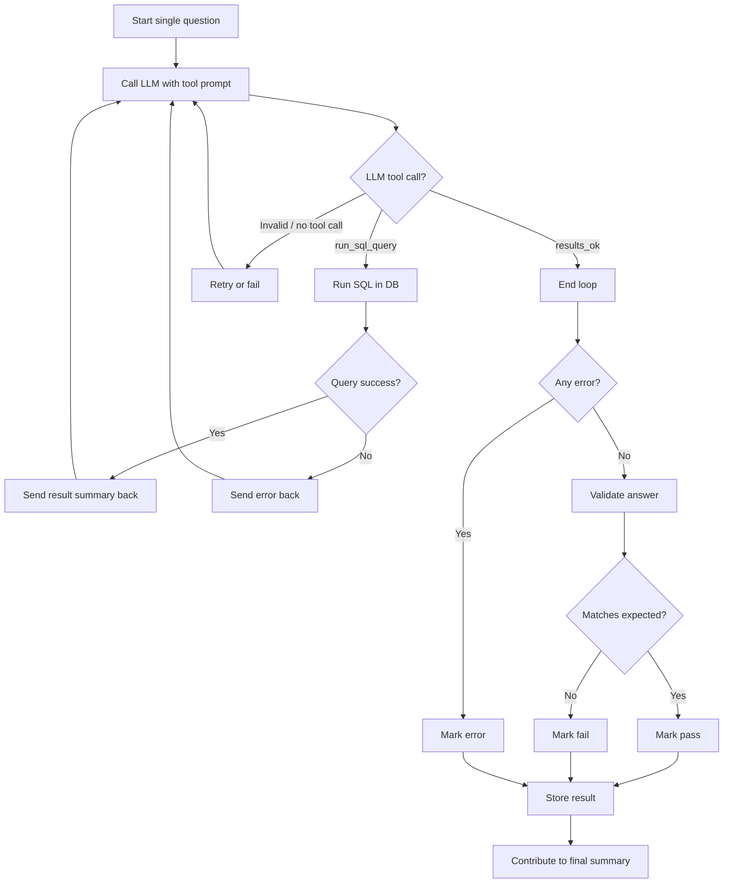

# llm_sql_benchmark: An LLM SQL Generation Benchmark

A benchmark for evaluating how well LLMs can generate SQL queries from natural language questions. Models are tested against the [Microsoft AdventureWorks](https://learn.microsoft.com/en-us/sql/samples/adventureworks-install-configure) sample database using an agentic tool-calling loop where the LLM iteratively writes and corrects SQL until it's satisfied with the results.

25 questions span four difficulty levels -- from simple single-table lookups to multi-table joins with window functions and CTEs. Results are validated automatically against expected answers.

> [!TIP]
> View the current results at the [SQL-Benchmark Site](https://sql-benchmark.nicklothian.com/)

## How to run the benchmark yourself

### Using the website

The site includes an in-browser benchmark runner powered by DuckDB-WASM. Select questions, enter your API endpoint and key, and run the benchmark directly -- no local setup required.

### Using the CLI

From the repository root:

```bash
npm install

npm run benchmark:cli -- \
  --endpoint https://openrouter.ai/api/v1/chat/completions \
  --api-key $OPENROUTER_API_KEY \
  --model "nvidia/nemotron-3-super-120b-a12b:free"
```

Any OpenAI-compatible endpoint works (OpenRouter, Ollama, llama.cpp, etc.). Key options:

| Argument | Description |
|---|---|
| `--endpoint <url>` | OpenAI-compatible chat completions URL (required) |
| `--api-key <key>` | API key / Bearer token |
| `--model <name>` | Model name to send in requests |
| `--difficulty <level>` | Filter by `trivial`, `easy`, `medium`, or `hard` (repeatable) |
| `--question <id>` | Run a single question by ID |
| `--timeout <seconds>` | Per-question timeout (default: 120) |
| `--output <path>` | Output JSON file path |
| `--grammar` | Use grammar-constrained mode instead of tool-calling |

Results are written to `data/benchmarks/` as JSON. See [apps/cli/docs/benchmark.md](../apps/cli/docs/benchmark.md) for full documentation.

## How to run the site locally

From the repository root:

```bash
npm install
npm run site:dev
```

This runs data preparation steps (syncing logs, generating expected answers, compressing assets) then starts an Astro dev server. Any benchmarks you've run locally will appear in the results.

To build for production:

```bash
npm run site:build
npm run site:preview
```

## How it works

Each question goes through a tool-calling loop where the LLM has access to two tools:

- **`run_sql_query(sql)`** -- execute SQL against DuckDB and get back a summary (row count, columns, first row)
- **`results_ok()`** -- signal that the query results look correct

The LLM can call `run_sql_query` multiple times to explore the schema and fix errors before confirming with `results_ok`. A hard cap of 20 LLM calls and a per-question timeout prevent runaway loops.

After the loop, results are validated against expected answers: row count, column names (case-insensitive), column count, and first-row values (with numeric tolerance).



## Project structure

```
llm-sql-benchmark/
  apps/cli/               CLI benchmark runner
  packages/core/           Shared benchmark logic (tool loop, validation, prompts)
  packages/data-adventureworks/  Questions, expected answers, and CSV table data
  site/                    Astro + React web frontend
  data/benchmarks/         Benchmark result JSON files (74+ models tested)
  data/logs/               Structured LLM call logs (JSONL)
  scripts/                 Data preparation and maintenance scripts
```

## Other useful commands

```bash
npm run rescore           # Re-validate existing benchmark results
npm run sync-logs         # Check benchmark/log consistency
npm run generate-answers  # Regenerate expected answers from reference SQL
npm run check             # Run lint + tests + typecheck
```
