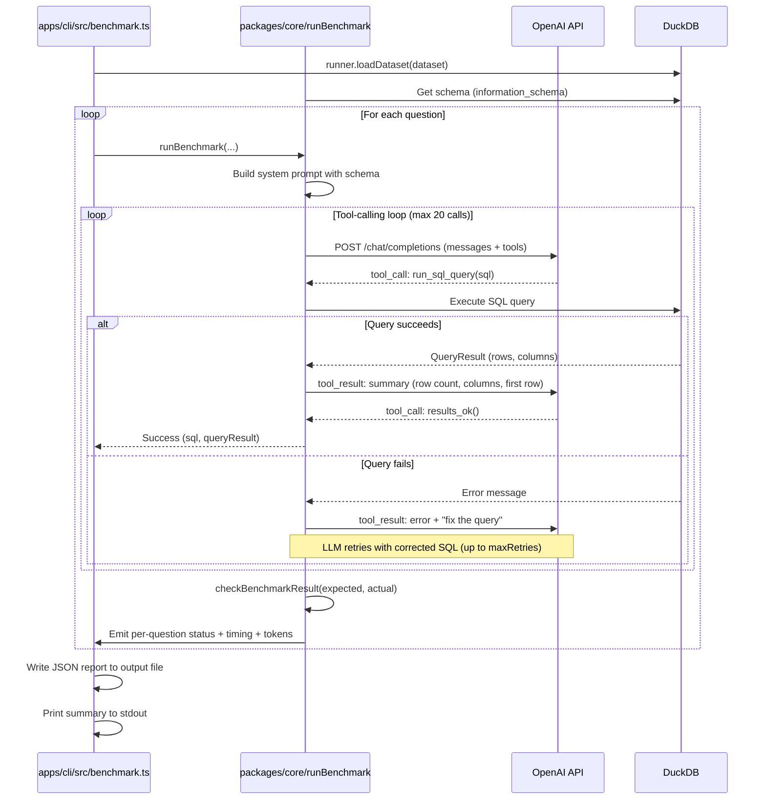

# CLI Benchmark Tool

The CLI benchmark tool runs benchmark questions against any OpenAI-compatible API endpoint from the command line. It loads CSV data into DuckDB, sends each question to an LLM via tool-calling, validates the results against expected answers, and writes a JSON report.

## Usage

```bash
npx tsx apps/cli/src/benchmark.ts [options]
```

Or via npm script:

```bash
npm run benchmark:cli -- [options]
```

## Arguments

| Argument | Required | Default | Description |
|---|---|---|---|
| `--endpoint <url>` | Yes | | OpenAI-compatible chat completions endpoint |
| `--api-key <key>` | No | | API key (Bearer token) |
| `--model <name>` | No | *(from API)* | Model name to send in requests |
| `--data-dir <path>` | Yes | | Directory with `tables/*.csv` and `questions.json` |
| `--difficulty <level>` | No | all | Filter: `trivial`, `easy`, `medium`, `hard` (repeatable) |
| `--timeout <seconds>` | No | 120 | Per-question timeout |
| `--question <id>` | No | | Run a single question by ID |
| `--output <path>` | No | `benchmark-<model>.json` | Output JSON file path |
| `--model-variant <tag>` | No | | Appended to default output filename |

## Architecture

The CLI now delegates benchmark orchestration to the shared core package:

- **`packages/core`** -- Owns prompt building, tool/grammar loops, retries, timeout handling, result validation, and report generation.
- **`packages/data-adventureworks`** -- Owns the benchmark dataset manifest and table asset resolvers.
- **`apps/cli/src/benchmark.ts`** -- Entry point that wires CLI arguments to core/data adapters and writes output JSON.
- **`apps/cli/src/duckdb-runner.ts`** -- Node DuckDB adapter implementing the core `BenchmarkSqlRunner` interface.
- **`apps/cli/src/client-adapters.ts`** -- OpenAI-compatible client adapters implementing core benchmark client interfaces.

## Tool Loop

The core benchmark loop (`runBenchmark` in `packages/core`) drives the LLM through a structured conversation using two tools:

- **`run_sql_query(sql)`** -- Execute a SQL query against DuckDB
- **`results_ok()`** -- Confirm the query results are correct

### How it works

1. A system prompt is built containing the full database schema (table names, column names, and types).
2. The user's question is sent as the first message.
3. The LLM is called with both tools available.
4. When the LLM calls `run_sql_query`, the SQL is executed against DuckDB:
   - On success: a summary (row count, columns, first row) is fed back as a tool result.
   - On error: the error message is fed back, asking the LLM to fix the query.
5. When the LLM calls `results_ok`, the loop exits successfully with the last SQL and query result.
6. If a query fails more than `maxRetries` (default 2) consecutive times, the loop exits with an error.
7. A hard cap of 20 total LLM calls prevents infinite loops.
8. An `AbortController` enforces the per-question timeout.

### Result validation

After each question, `checkBenchmarkResult()` (from `packages/core`) validates:
- Row count matches expected
- Column names match (case-insensitive)
- Column count matches
- First row values match (with loose numeric comparison, tolerance of 0.01)

## Sequence Diagram



## Output Format

The JSON output file has this structure:

```json
{
  "meta": {
    "endpoint": "http://localhost:11434/v1/chat/completions",
    "model": "gemma3:1b",
    "modelVariant": "my-variant",
    "timestamp": "2026-03-06T12:00:00.000Z",
    "timeoutSec": 120
  },
  "summary": {
    "total": 30,
    "passed": 20,
    "failed": 8,
    "errored": 2,
    "totalInputTokens": 50000,
    "totalOutputTokens": 10000
  },
  "results": [
    {
      "id": 1,
      "question": "How many customers are there?",
      "difficulty": "trivial",
      "status": "pass",
      "durationMs": 1234,
      "attempts": 1,
      "sql": "SELECT COUNT(*) AS customer_count FROM \"Customer\"",
      "error": null,
      "inputTokens": 1500,
      "outputTokens": 200,
      "result": {
        "rowCount": 1,
        "columns": ["customer_count"],
        "firstRow": { "customer_count": "18484" }
      },
      "check": {
        "rowCountMatch": true,
        "columnCountMatch": true,
        "columnNamesMatch": true,
        "firstRowMatch": true,
        "actualRowCount": 1,
        "actualColumnCount": 1,
        "missingColumns": [],
        "extraColumns": [],
        "firstRowDiffs": []
      }
    }
  ]
}
```

### Per-question `status` values

- **`pass`** -- All checks passed (row count, columns, first row)
- **`fail`** -- Query executed but results didn't match expected
- **`error`** -- Tool loop failed (timeout, max retries exhausted, API error)
