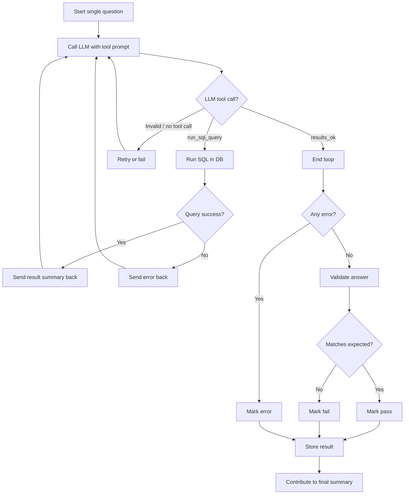

import BenchmarkPage from '../components/BenchmarkPage.jsx';
import BenchmarkResults from '../components/BenchmarkResults.jsx';
import Heatmap from '../components/Heatmap.jsx';
import BubbleChart from '../components/BubbleChart.jsx';
import QuestionExplorer from '../components/QuestionExplorer.jsx';
import CollapsibleSection from '../components/CollapsibleSection.jsx';
import ExpandableContent from '../components/ExpandableContent.jsx';

# A Rapid Benchmark for Agentic SQL Generation

## Introduction

I'm building a self-hosted (in browser!) agentic data 
analyst tool. As part of that I've been trying to find 
good small models to recommend. 

It's really hard to work out what actually works for my problem as well as things like exactly 
which quantization level for local models is the trade-off I want. 

I started building a benchmark for running against in-browser models, but it is too slow for all but the 
very simplist cases. 

Instead, I build a 25-question English-to-SQL generation test, with a agentic check-correct loop 
using DuckDB against CSV data. 

Most benchmarks take hours to run or saturated. This takes less than 5 minutes to run on 
all but the very slowest models and is able to consistently provide separation between even the strongest models. 
No model gets everything right, but all questions are answered correctly by multiple models. 

### Data

Data is derived from the [Microsoft AdventureWorks Sample Database](https://github.com/microsoft/sql-server-samples/tree/master/samples/databases) 
used under the MIT License. 

This version is taken from the [PowerBI Desktop Sample model here](https://github.com/pbi-tools/adventureworksdw2020-pbix) by Mathias Thierbach. 


### Sample queries and SQL

The queries are categorized into Trivial, Easy, Medium and Hard. 

**Trivial** are `Single table; simple SELECT; at most 2 columns; no aggregation or GROUP BY`. 
These are the level of question that in-browser models have some hope of answering. 

For example:

```
List all distinct product categories. Return columns: Category. Sort by Category ascending.
```

That should generate SQL like this:

```
SELECT DISTINCT Category FROM Product ORDER BY Category
```

Note that we don't score the SQL itself, only the results.

By contrast **hard** questions are much more complex. The hardest question (Q9, with only 4 correct results) is this:

```
Show order lines, revenue, units sold, revenue per unit (total revenue ÷ total units sold), 
average list price per product in the subcategory, gross profit, and margin percentage 
for each product subcategory. 
Return columns: Subcategory, order_lines, revenue, units_sold, revenue_per_unit, avg_list_price, gross_profit, margin_pct. 
Sort by revenue descending.
```

The SQL that correctly generates that is this:

```
SELECT 
  p.Subcategory, COUNT(*) AS order_lines, 
  ROUND(SUM(s."Sales Amount"), 2) AS revenue, 
  SUM(s."Order Quantity") AS units_sold, 
  ROUND(SUM(s."Sales Amount") / SUM(s."Order Quantity"), 2) AS revenue_per_unit, 
  ROUND(sub.avg_list_price, 2) AS avg_list_price, 
  ROUND(SUM(s."Sales Amount" - s."Total Product Cost"), 2) AS gross_profit, 
  ROUND(SUM(s."Sales Amount" - s."Total Product Cost") / SUM(s."Sales Amount") * 100, 1) AS margin_pct 
FROM 
  Sales s JOIN Product p ON s.ProductKey = p.ProductKey 
  JOIN (SELECT Subcategory, AVG("List Price") AS avg_list_price FROM Product GROUP BY Subcategory) sub ON p.Subcategory = sub.Subcategory 
GROUP BY p.Subcategory, sub.avg_list_price 
ORDER BY revenue DESC
```

<CollapsibleSection client:load title="Explore all the questions">
  <QuestionExplorer client:load showTitle={false} />
</CollapsibleSection>


### Query generation

At a high level, the LLM takes an English question and a database schema description and generates SQL. The SQL is run in DuckDB 
and any errors or a sample of the result set is given back to the LLM. The LLM fixes the SQL or decides it is finished. 
This loop continues (with various loop limits and timeouts) until the LLM decides it is finished.

When the LLM is finished the SQL is passed to the benchmark harness for scoring. The harness runs the SQL and 
checks the results against a known-good result set. There are allowances for rounding to different decimal points but other than 
that we expect a match. 

<ExpandableContent client:load maxWidth={400}>

</ExpandableContent>


There are three possible outcomes:
- Pass: results match what we expect. 
- Fail: valid SQL is generated but the results are not correct.
- Error: something went wrong in the agentic process. There are three main categories here
  - SQL is invalid after multiple attempts.
  - The model was unable to correctly perform tool use/function calling. 
  - Timeout or too many attempts: We have limits on how long each stage takes and how many attempts a model gets. 


## The Frontier

There are four clear winners in this benchmark. Claude Sonnet 4.6, 
Claude Opus 4.6, GLM-5-Turbo and Grok 4.1 Fast all scored 24/25.

The two Anthropic models are expensive: 63 cents for Opus and 41 cents for Sonnet. 

Grok 4.1 Fast cost 3 cents, but took 405 seconds (ver slow for a *fast* model!), 
while GLM-5-Turbo cost 7 cents but took 186 seconds. In my view 
both of these are fair prices for such a high level of performance. 

It's worth noting that none of these models are open weights. GLM-5 (non Turbo) is, but 
for now if you want the absolute best models there is no way to self-host. 

<Heatmap client:load
          showTitle={false}
          models={[
                  "anthropic/claude-4.6-sonnet-20260217",
                  "anthropic/claude-4.6-opus-20260205",
                  "x-ai/grok-4.1-fast",
                  "z-ai/glm-5-turbo-20260315"
                ]} />

<BenchmarkResults client:load
          showTitle={false}
          models={[
                  "anthropic/claude-4.6-sonnet-20260217",
                  "anthropic/claude-4.6-opus-20260205",
                  "x-ai/grok-4.1-fast",
                  "z-ai/glm-5-turbo-20260315"
                ]} />


## Open models

Kimi K2.5, Qwen 3.5 27B and Qwen 3.5 397b-a17b (all on 23/25) are the best open models available. 

Special note should be taken of **Qwen 3.5 27B**. It's a 27B dense model that is feasible to run at decent speeds 
on consumer hardware and outperforming trillion parameter open models as well as Google Gemini 3.1 Pro. 

Minimax M2.7, Xiaomi Mimo v2-Flash and GLM-5 (22/25) also give good performances. 
Xiaomi Mimo v2-Flash is also notable for its speed (109s) and price (0.3 cents).

Note that Qwen 3.5-Flash, Mimo v2-Pro and Kat-Coder-Pro-v1 are not open models. 

<CollapsibleSection client:load title="The Best Open Model Scores">
  <BenchmarkResults client:load
            showTitle={false}
            models={["moonshotai/kimi-k2.5-0127",
                    "qwen/qwen3.5-27b-20260224",
                    "qwen/qwen3.5-397b-a17b-20260216",
                    "minimax/minimax-m2.7-20260318",
                    "xiaomi/mimo-v2-flash-20251210",
                    "z-ai/glm-5-20260211"
                  ]} />
</CollapsibleSection>


## Best Trade-offs

If you are trying to choose a model here are the best choices.

### Best overall

If you want the best possible score, then choose **GLM-5-Turbo** (if you want speed and good price) or **Grok-4.1-Fast** (if you want a great price).
The two Claude models are overpriced in for the performance they give on this task. 

### Best for self hosting

**Qwen 3.5 27B** is an *amazing* model. You can feasibly run it on consumer local hardware with decent performance 
(expect [~44 TPS for an 8B Quantization on a RTX-5090](https://www.canirun.ai/model/qwen3.5-27b)), and it outscores models nearly 2 orders of magnitude bigger. 

### Best balance of price, speed and score

**Xiaomi Mimi-v2-Flash** scores one point less than three other open models and two behind the very top models, 
but it is so much faster and cheaper it is worth using.

### Fastest models

The diffusion based Inception Mercury-2 model can complete the whole benchmark in **48 seconds** via OpenRouter. 
That's over twice as fast as Xiaomi Mimi-v2-Flash or nearly 10 times faster than Grok 4.1-Fast. 

It struggles with tool-calling. I ran it using the prompts for grammar based processing (see below) and it went from a inadequate 16/25 
to a reasonable 19/25. That makes it worth exploring, but probably difficult to harness reliably. 

<ExpandableContent client:load maxWidth={600}>

<BubbleChart client:load
          showTitle={false}
          models={["x-ai/grok-4.1-fast",
                "z-ai/glm-5-turbo-20260315",
                "qwen/qwen3.5-27b-20260224",
                "xiaomi/mimo-v2-flash-20251210",
                "inception/mercury-2-20260304 (no-tools)"
                ]} />    

</ExpandableContent>

 
## Anthropic Claude vs OpenAI GPT vs Google Gemini

For this task, both Claude Sonnet 4.6 and Claude Opus 4.6 get identical evaluation scores 
and top the leaderboard (along with GLM-5-Turbo and Grok-4.1-Fast) with 24/25.

Both failed at Question 9, which is the hardest question in the benchmark - 
only 4 models get it right.

Next we have Gemini 3.1 Flash Lite Preview (WTF with the names Google!?),
GPT-5.4 and GPT-5.4 mini, all scoring 22/25. There are some interesting trade-offs with these models:
GPT-5.4 mini is the fastest (71 seconds - exactly twice as fast as Gemini Flash Lite in 142 seconds), but 
Gemini Flash Lite is much cheaper (2 cents vs 6 cents for GPT 5.4-mini vs 24 cents for GPT-5.4)

Bundling the models at 21/25 and 20/25 together we see Gemini 3.1 Pro (very slow at 700 seconds, very expensive at 51 cents),
GPT-5.3-codex which is slow and expensive here (but I quite like coding with), GPT-5.4 Nano (slower than GPT-5.4 Mini, cheap at 2c but really outgunned by Gemini 3.1 Gemini Flash Lite).

I included GPT-4.1 for interest, but it still did well here! It matched Google's frontier Gemini Pro model for score, while being much faster and much cheaper. That surprised me. 

Dropping down another point to 20/25 there is Claude Haiku 4.5 which can't be recommended 
in this group - it is slow and too expensive. GPT 5.3 Nano is twice as fast, 1/10th the cost an scores the same. 

Still at 20/25 and punching way above expectations is the free OpenRouter version of GPT-OSS-20B. It is very slow (550 seconds) but somehow 
it outperfomed the paid version of GPT-OSS-120B and the paid version of GPT-OSS-20B. Perhaps they are run by different providers with different quantization but in any case - it did well!

I included GPT-3.5 for interest sake. It doesn't support tool calling or have grammar support
so the grammar label here is just showing that it relied on prompting to work. 


<CollapsibleSection client:load title="Claude vs GPT vs Gemini Scores">

  <BenchmarkResults client:load
            showTitle={false}
            models={["anthropic/claude-4.5-haiku-20251001", 
                    "anthropic/claude-4.6-sonnet-20260217",
                    "anthropic/claude-4.6-opus-20260205",
                    "google/gemini-3.1-flash-lite-preview-20260303",
                    "google/gemini-3.1-pro-preview-20260219",
                    "openai/gpt-5.4-20260305",
                    "openai/gpt-3.5-turbo",
                    "openai/gpt-4.1-2025-04-14",
                    "openai/gpt-5.3-codex-20260224",
                    "openai/gpt-5.4-mini-20260317",
                    "openai/gpt-5.4-nano-20260317",
                    "openai/gpt-oss-20b:free",
                    "openai/gpt-oss-20b",
                    "openai/gpt-oss-120b:free"
                  ]} />
</CollapsibleSection>

<CollapsibleSection client:load title="Claude vs GPT vs Gemini Details">

  <Heatmap client:load
            showTitle={false}
            models={["anthropic/claude-4.5-haiku-20251001", 
                    "anthropic/claude-4.6-sonnet-20260217",
                    "anthropic/claude-4.6-opus-20260205",
                    "google/gemini-3.1-flash-lite-preview-20260303",
                    "google/gemini-3.1-pro-preview-20260219",
                    "openai/gpt-5.4-20260305",
                    "openai/gpt-3.5-turbo",
                    "openai/gpt-4.1-2025-04-14",
                    "openai/gpt-5.3-codex-20260224",
                    "openai/gpt-5.4-mini-20260317",
                    "openai/gpt-5.4-nano-20260317",
                    "openai/gpt-oss-20b:free",
                    "openai/gpt-oss-20b",
                    "openai/gpt-oss-120b:free"
                  ]} />


  <BubbleChart client:load
            showTitle={false}
            models={["anthropic/claude-4.5-haiku-20251001", 
                    "anthropic/claude-4.6-sonnet-20260217",
                    "anthropic/claude-4.6-opus-20260205",
                    "google/gemini-3.1-flash-lite-preview-20260303",
                    "google/gemini-3.1-pro-preview-20260219",
                    "openai/gpt-5.4-20260305",
                    "openai/gpt-3.5-turbo",
                    "openai/gpt-4.1-2025-04-14",
                    "openai/gpt-5.3-codex-20260224",
                    "openai/gpt-5.4-mini-20260317",
                    "openai/gpt-5.4-nano-20260317",
                    "openai/gpt-oss-20b:free",
                    "openai/gpt-oss-20b",
                    "openai/gpt-oss-120b:free"
                  ]} />                    
</CollapsibleSection>

## The Qwen Masterclass

No matter what size class you are looking at, Qwen has a model for you. At the top of the leaderboard,
Qwen3.5-397b-a17b and Qwen3.5-27b both sit one point off the out-right lead. 

Nothing comes close to Qwen3.5-27b in terms of practicallity... except perhaps for Qwen3.5-35b-a3b
if you prefer a Mixture-of-Experts model. 

At the competitive 9B class, Qwen 9B is the default choice. Only NVidia's Nemotron 3 9B is worth looking at 
in the same class, but that is 2 points behind. 

One thing to note though is that the Qwen3.5 9B on OpenRouter is significantly worse than any model you run yourself. 


## Promises, Promises 

The following models claim the weights will be released but haven't at the time of writing:

* MiniMax 2.7

## Small models

### Thinking vs Non-Thinking

<Heatmap client:load
          showTitle={"Thinking vs Non-Thinking for small models"}
          models={[
                  "unsloth/Qwen3.5-9B-GGUF:Q4_K_M (thinking)",
                  "unsloth/Qwen3.5-9B-GGUF:Q4_K_M (no-thinking)",

                  "unsloth/Qwen3.5-4B-GGUF:Q4_0 (thinking)",
                  "unsloth/Qwen3.5-4B-GGUF:Q4_0 (no-thinking)",

                  "unsloth/Qwen3.5-2B-GGUF:Q8_0 (thinking)",
                  "unsloth/Qwen3.5-2B-GGUF:Q8_0 (no-thinking)",

                  "unsloth/Qwen3.5-0.8B-GGUF:Q8_0 (thinking)", 
                  "unsloth/Qwen3.5-0.8B-GGUF:Q8_0 (no-thinking)",
                ]} />

### Quantization

Qantization is usually neccessary to run local models at decent speed. 
Unsloth makes numerous quantizations using many fairly undecipherable methods. 

Here we tested [Unsloth quantizations of Qwen3.5-4B](https://huggingface.co/unsloth/Qwen3.5-4B-GGUF) 
in 8-bit Q8_0 (4.48 GB), 4-bit Q4_0 (2.58 GB) and 2-bit UD-IQ2_XXS (1.52 GB) sizes. 

The numbers really speak for themselves. Q4_0 works well, UD-IQ2_XXS doesn't. 

The [OpenRouter Qwen3.5 9B](https://openrouter.ai/qwen/qwen3.5-9b) isn't great either. 

<Heatmap client:load
          showTitle={"Unsloth quantizations of Qwen3.5-4B"}
          models={[
                  "unsloth/Qwen3.5-4B-GGUF:UD-IQ2_XXS",
                  "unsloth/Qwen3.5-4B-GGUF:Q4_0 (no-thinking)",
                  "unsloth/Qwen3.5-4B-GGUF:Q8_0",
                  "qwen/qwen3.5-9b-20260310 (openrouter)"
                ]} />


### Grammar Mode

Small, local models at 2B parameters or below have a much higher *error* rate than *failure* rate. Recall that errors occur 
when something fails in the agentic harness, as opposed to failures, where the SQL is generated but incorrect. Often this 
because the models are not reliable at tool use/function calling - especially as the context gets longer. 

To attempt to address this, the benchmark has `--grammar` mode, specific to use against llama.cpp. 
In this mode a [GGML BNF grammar](https://github.com/ggml-org/llama.cpp/blob/master/grammars/README.md) is generated that 
defines valid SQL Syntax along with the tables and columns available to the query. 

Then instead of tool calling, the model just returns either the SQL query or the string `OK`.

Does this work? 

Unfortunatly, for small models it doesn't seem to. 

<Heatmap client:load
          showTitle={"Grammar vs Tool Use for small models"}
          models={[
                  "unsloth/Qwen3.5-9B-GGUF:Q4_K_M (no-thinking)",
                  "unsloth/Qwen3.5-9B-GGUF:Q4_K_M (grammar-no-thinking)", 
                  "unsloth/Qwen3.5-4B-GGUF:Q4_0 (grammar)",
                  "unsloth/Qwen3.5-4B-GGUF:Q4_0 (no-thinking)",
                  "unsloth/Qwen3.5-2B-GGUF:Q8_0 (grammar-no-thinking)",
                  "unsloth/Qwen3.5-2B-GGUF:Q8_0 (no-thinking)",
                ]} />

Interestingly, for the Inception Mercury 2 models we do see an improvement in performance when we use this prompt format. 
It is unclear why they underperform so badly in tool calling but perhaps they were not post trained as heavily for that scenario.
In this case it isn't the grammar though - OpenRouter doesn't pass that through to the model. 

<Heatmap client:load
          showTitle={"Inception Mercury 2 with vs without tool use"}
          models={["inception/mercury-2-20260304", 
                   "inception/mercury-2-20260304 (no-tools)"
                ]} />


## All Data

<BenchmarkPage client:load />
