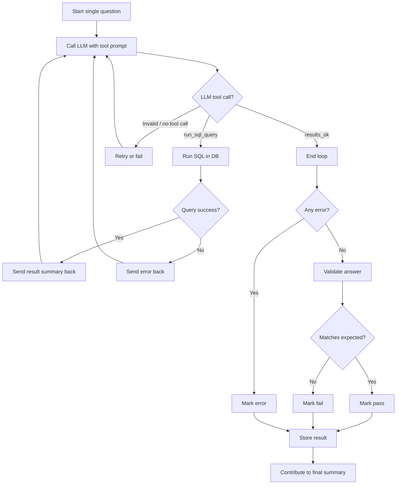

import SqlRunner from '../components/SqlRunner.jsx';
import Tabs from "../components/Tabs.jsx";
import BenchmarkPage from '../components/BenchmarkPage.jsx';
import BenchmarkResults from '../components/BenchmarkResults.jsx';
import Heatmap from '../components/Heatmap.jsx';
import BubbleChart from '../components/BubbleChart.jsx';
import QuestionExplorer from '../components/QuestionExplorer.jsx';
import CollapsibleSection from '../components/CollapsibleSection.jsx';
import ExpandableContent from '../components/ExpandableContent.jsx';
import BenchmarkRunner from '../components/BenchmarkRunner.jsx';

# A Rapid Benchmark for Agentic SQL Generation


> [!NOTE]
> This is an interactive document. Anywhere you see an SQL query, you can run it, and it will be executed using
> [DuckDB-WASM](https://github.com/duckdb/duckdb-wasm) in your browser. The same DuckDB-WASM technology allows us
> to run the benchmark itself in the browser. You give it an endpoint, a model ID, and optionally an API key, and exactly the
> same TypeScript code used at the command line is executed in the browser. [Try it here](#run-your-own-benchmark).

[Jump to the results](#all-data)

## Introduction

I'm building a self-hosted (in-browser!) agentic data 
analyst tool. As part of that, I've been trying to find 
good small models to recommend. 

It's really hard to work out what actually works for my problem, as well as things like exactly 
which quantization level for local models gives the trade-off I want. 

I started building a benchmark for running against in-browser models, but it is too slow for all but the 
very simplest cases. 

Instead, I built a 25-question English-to-SQL generation test with an agentic check-correct loop 
using DuckDB against CSV data. 

Most benchmarks either take hours to run or are already saturated. This one takes less than 5 minutes to run on 
all but the very slowest models and is able to consistently separate even the strongest models. 
No model gets everything right, but every question is answered correctly by multiple models.

Unlike most existing text-to-SQL generation benchmarks, this is explicitly agentic: there is a debug loop where the agent 
checks the results and can correct any issues. 


### Data

Data is derived from the [Microsoft AdventureWorks Sample Database](https://github.com/microsoft/sql-server-samples/tree/master/samples/databases) 
used under the MIT License. 

This version is taken from the [PowerBI Desktop Sample model here](https://github.com/pbi-tools/adventureworksdw2020-pbix) by Mathias Thierbach. 


### Sample queries and SQL

The queries are categorized as Trivial, Easy, Medium, and Hard. 

**Trivial** questions are `Single table; simple SELECT; at most 2 columns; no aggregation or GROUP BY`. 
These trivial questions are at the level of difficulty that in-browser models have some hope of answering. 

For example:

```
List all distinct product categories. Return columns: Category. Sort by Category ascending.
```

That should generate SQL like this:

<SqlRunner 
  client:visible
  tables={["Product"]}
  defaultSql={`SELECT DISTINCT Category FROM Product ORDER BY Category`}
/>


Note that we don't score the SQL itself, only the results.

By contrast, **hard** questions are much more complex. The hardest question (Q9, with only 4 correct results) is this:

```
Show order lines, revenue, units sold, revenue per unit (total revenue ÷ total units sold), average list price per product in the subcategory, 
gross profit, and margin percentage for each product subcategory. 

Return columns: Subcategory, order_lines, revenue, units_sold, revenue_per_unit, avg_list_price, gross_profit, margin_pct. 

Sort by revenue descending.
```

This is the canonical SQL that produces the correct result set:

<SqlRunner 
  client:visible
  tables={["Sales", "Product"]}
  defaultSql={`SELECT
  p.Subcategory, COUNT(*) AS order_lines,
  ROUND(SUM(s."Sales Amount"), 2) AS revenue,
  SUM(s."Order Quantity") AS units_sold,
  ROUND(SUM(s."Sales Amount") / SUM(s."Order Quantity"), 2) AS revenue_per_unit,
  ROUND(sub.avg_list_price, 2) AS avg_list_price,
  ROUND(SUM(s."Sales Amount" - s."Total Product Cost"), 2) AS gross_profit,
  ROUND(SUM(s."Sales Amount" - s."Total Product Cost") / SUM(s."Sales Amount") * 100, 1) AS margin_pct
FROM
  Sales s JOIN Product p ON s.ProductKey = p.ProductKey
  JOIN (SELECT Subcategory, AVG("List Price") AS avg_list_price FROM Product GROUP BY Subcategory) sub ON p.Subcategory = sub.Subcategory
GROUP BY p.Subcategory, sub.avg_list_price
ORDER BY revenue DESC`}
/>

<CollapsibleSection client:load title="Explore all the questions">
  <QuestionExplorer client:load showTitle={false} />
</CollapsibleSection>


### Query generation

At a high level, the LLM takes an English question and a database schema description and generates SQL. The SQL is run in DuckDB 
and any errors or a sample of the result set are given back to the LLM. The LLM either fixes the SQL or decides it is finished. 
This loop continues (with various loop limits and timeouts) until the LLM decides it is finished.

When the LLM is finished, the SQL is passed to the benchmark harness for scoring. The harness runs the SQL and 
checks the results against a known-good result set. There are allowances for rounding to different decimal places, but other than 
that we expect a match. 

<ExpandableContent client:load maxWidth={400}>

</ExpandableContent>


There are three possible outcomes:
- Pass: results match what we expect. 
- Fail: valid SQL is generated but the results are not correct.
- Error: something went wrong in the agentic process. There are three main categories here:
  - SQL is invalid after multiple attempts.
  - The model was unable to correctly perform tool use/function calling. 
  - Timeout or too many attempts: We have limits on how long each stage takes and how many attempts a model gets. 


## The Frontier

There are four clear winners in this benchmark. Claude Sonnet 4.6, 
Claude Opus 4.6, GLM-5-Turbo, and Grok 4.1 Fast all scored 24/25.

The two Anthropic models are expensive: 63 cents for Opus and 41 cents for Sonnet. 

Grok 4.1 Fast cost 3 cents, but took 405 seconds (very slow for a *fast* model!), 
while GLM-5-Turbo cost 7 cents but took 186 seconds. In my view, 
both of these are fair prices for such a high level of performance. 

It's worth noting that none of these models are open weights 
(note that GLM-5, non-Turbo, is open weights, but the Turbo version is closed. 
Their similar names have caused some confusion).

For now, if you want the absolute best models, there is no way to self-host. 

<Heatmap client:load
          showTitle={false}
          models={[
                  "anthropic/claude-4.6-sonnet-20260217",
                  "anthropic/claude-4.6-opus-20260205",
                  "x-ai/grok-4.1-fast",
                  "z-ai/glm-5-turbo-20260315"
                ]} />

<BenchmarkResults client:load
          showTitle={false}
          models={[
                  "anthropic/claude-4.6-sonnet-20260217",
                  "anthropic/claude-4.6-opus-20260205",
                  "x-ai/grok-4.1-fast",
                  "z-ai/glm-5-turbo-20260315"
                ]} />


## Open models

Kimi K2.5, Qwen 3.5 27B, and Qwen 3.5 397B-A17B (all on 23/25) are the best open models available. 

Special note should be made of **Qwen 3.5 27B**. It's a 27B dense model that is feasible to run at decent speeds 
on consumer hardware while outperforming trillion-parameter open models, including Google Gemini 3.1 Pro. 

Minimax M2.7, Xiaomi Mimo v2-Flash, and GLM-5 (22/25) are other high-performance models. 
Xiaomi Mimo v2-Flash is also notable for its speed (109s) and price (0.3 cents).

Note that Qwen 3.5-Flash, Mimo v2-Pro and Kat-Coder-Pro-v1 are not open models. 

<CollapsibleSection client:load title="The Best Open Model Scores">

  <Heatmap client:load
            showTitle={false}
            models={["moonshotai/kimi-k2.5-0127",
                    "qwen/qwen3.5-27b-20260224",
                    "qwen/qwen3.5-397b-a17b-20260216",
                    "minimax/minimax-m2.7-20260318",
                    "xiaomi/mimo-v2-flash-20251210",
                    "z-ai/glm-5-20260211"
                  ]} />

  <BenchmarkResults client:load
            showTitle={false}
            models={["moonshotai/kimi-k2.5-0127",
                    "qwen/qwen3.5-27b-20260224",
                    "qwen/qwen3.5-397b-a17b-20260216",
                    "minimax/minimax-m2.7-20260318",
                    "xiaomi/mimo-v2-flash-20251210",
                    "z-ai/glm-5-20260211"
                  ]} />

</CollapsibleSection>


## Best Trade-offs

If you are trying to choose a model, here are the best choices.

### Best overall

If you want the best possible score, choose **GLM-5-Turbo** (if you want speed and a good price) or **Grok 4.1 Fast** (if you want a great price).
The two Claude models are overpriced for the performance they give on this task. 

### Best for self-hosting

**Qwen 3.5 27B** is an *amazing* model. You can feasibly run it on consumer local hardware with decent performance 
(expect [~44 TPS for an 8-bit quantization on an RTX-5090](https://www.canirun.ai/model/qwen3.5-27b)), and it outscores models nearly 2 orders of magnitude bigger. 

### Best balance of price, speed, and score

**Xiaomi Mimo v2-Flash** scores one point below three other open models and two points behind the very top models, 
but it is so much faster and cheaper that it is worth using.

### Fastest models

The diffusion-based Inception Mercury-2 model can complete the whole benchmark in **48 seconds** via OpenRouter. 
That's over twice as fast as Xiaomi Mimo v2-Flash, or nearly 10 times faster than Grok 4.1 Fast. 

It struggles with tool-calling. I ran it using the prompts for [grammar-based processing](#grammar-mode), and it went from an inadequate 16/25 
to a reasonable 19/25. That makes it worth exploring, but it is probably difficult to harness reliably. 

<ExpandableContent client:load maxWidth={600}>

<BubbleChart client:load
          showTitle={false}
          models={["x-ai/grok-4.1-fast",
                "z-ai/glm-5-turbo-20260315",
                "qwen/qwen3.5-27b-20260224",
                "xiaomi/mimo-v2-flash-20251210",
                "inception/mercury-2-20260304 (no-tools)"
                ]} />    

</ExpandableContent>

 
## Anthropic Claude vs OpenAI GPT vs Google Gemini

For this task, both Claude Sonnet 4.6 and Claude Opus 4.6 get identical evaluation scores 
and top the leaderboard (along with GLM-5-Turbo and Grok 4.1 Fast) with 24/25.

Both failed at Question 9, which is the hardest question in the benchmark: 
only 4 models get it right.

Next we have Gemini 3.1 Flash Lite Preview (WTF with the names, Google!?),
GPT-5.4, and GPT-5.4 mini, all scoring 22/25. There are some interesting trade-offs with these models:
GPT-5.4 mini is the fastest (71 seconds, exactly twice as fast as Gemini Flash Lite at 142 seconds), but 
Gemini Flash Lite is much cheaper (2 cents vs. 6 cents for GPT-5.4 mini vs. 24 cents for GPT-5.4).

Bundling the 21/25 and 20/25 scores together, we see Gemini 3.1 Pro (very slow at 700 seconds and very expensive at 51 cents),
GPT-5.3-codex, which is slow and expensive but one of the few models to get Question 9 correct, 
and GPT-5.4 Nano (slower than GPT-5.4 mini, cheap at 2 cents, but really outgunned by Gemini 3.1 Flash Lite).

I included GPT-4.1 for interest, but it still did well here! It matched Google's frontier Gemini Pro model for score while being much faster and much cheaper. That surprised me. 

Dropping down another point to 20/25, there is Claude Haiku 4.5, which can't be recommended 
in this group: it is slow and too expensive. GPT-5.3 Nano is twice as fast, one-tenth the cost, and scores the same. 

Still at 20/25 and punching way above expectations is the free OpenRouter version of GPT-OSS-20B. It is very slow (550 seconds) but somehow 
it outperformed the paid version of GPT-OSS-120B and the paid version of GPT-OSS-20B. Perhaps they are run by different providers with different quantizations, but in any case, it did well!

I included GPT-3.5 for interest's sake. It doesn't support tool calling or grammar mode,
so the grammar label here is just showing that it relied on prompting to work. 

<CollapsibleSection client:load title="Claude vs GPT vs Gemini Details">

  <Heatmap client:load
            showTitle={false}
            models={["anthropic/claude-4.5-haiku-20251001", 
                    "anthropic/claude-4.6-sonnet-20260217",
                    "anthropic/claude-4.6-opus-20260205",
                    "google/gemini-3.1-flash-lite-preview-20260303",
                    "google/gemini-3.1-pro-preview-20260219",
                    "openai/gpt-5.4-20260305",
                    "openai/gpt-3.5-turbo",
                    "openai/gpt-4.1-2025-04-14",
                    "openai/gpt-5.3-codex-20260224",
                    "openai/gpt-5.4-mini-20260317",
                    "openai/gpt-5.4-nano-20260317",
                    "openai/gpt-oss-20b:free",
                    "openai/gpt-oss-20b",
                    "openai/gpt-oss-120b:free"
                  ]} />

  <BenchmarkResults client:load
            showTitle={false}
            models={["anthropic/claude-4.5-haiku-20251001", 
                    "anthropic/claude-4.6-sonnet-20260217",
                    "anthropic/claude-4.6-opus-20260205",
                    "google/gemini-3.1-flash-lite-preview-20260303",
                    "google/gemini-3.1-pro-preview-20260219",
                    "openai/gpt-5.4-20260305",
                    "openai/gpt-3.5-turbo",
                    "openai/gpt-4.1-2025-04-14",
                    "openai/gpt-5.3-codex-20260224",
                    "openai/gpt-5.4-mini-20260317",
                    "openai/gpt-5.4-nano-20260317",
                    "openai/gpt-oss-20b:free",
                    "openai/gpt-oss-20b",
                    "openai/gpt-oss-120b:free"
                  ]} />

  <BubbleChart client:load
            showTitle={false}
            models={["anthropic/claude-4.5-haiku-20251001", 
                    "anthropic/claude-4.6-sonnet-20260217",
                    "anthropic/claude-4.6-opus-20260205",
                    "google/gemini-3.1-flash-lite-preview-20260303",
                    "google/gemini-3.1-pro-preview-20260219",
                    "openai/gpt-5.4-20260305",
                    "openai/gpt-3.5-turbo",
                    "openai/gpt-4.1-2025-04-14",
                    "openai/gpt-5.3-codex-20260224",
                    "openai/gpt-5.4-mini-20260317",
                    "openai/gpt-5.4-nano-20260317",
                    "openai/gpt-oss-20b:free",
                    "openai/gpt-oss-20b",
                    "openai/gpt-oss-120b:free"
                  ]} />                    
</CollapsibleSection>

## The Qwen Masterclass

No matter what size class you are looking at, Qwen has a model for you. At the top of the leaderboard,
Qwen 3.5 397B-A17B and Qwen 3.5 27B both sit one point off the outright lead. 

Nothing comes close to Qwen 3.5 27B in terms of practicality... except perhaps Qwen 3.5 35B-A3B
if you prefer a mixture-of-experts model. 

At the competitive 9B class, Qwen 9B is the default choice. Only NVIDIA's Nemotron 3 9B is worth looking at 
in the same class, but it is 2 points behind. The Opus reasoning-trace-tuned Jackrong models score slightly higher.

One thing to note, though, is that the Qwen 3.5 9B on OpenRouter is significantly worse than any model you run yourself. 

<BubbleChart client:load
          showTitle={false}
            models={[
                  "qwen/qwen3.5-397b-a17b-20260216",
                  "qwen/qwen3.5-122b-a10b-20260224",
                  "qwen/qwen3.5-35b-a3b-20260224",
                  "qwen/qwen3.5-27b-20260224",
                  "qwen/qwen3.5-flash-20260224",
                  "qwen/qwen3.5-9b-20260310 (openrouter)",
                  "qwen/qwen3-coder-next-2025-02-03",
                  "unsloth/Qwen3.5-35B-A3B-GGUF:UD-IQ3_S (MoE-offload)",
                  "unsloth/Qwen3.5-35B-A3B-GGUF:UD-IQ2_XXS (MoE-offload)",
                  "unsloth/Qwen3.5-9B-GGUF:Q4_K_M (thinking)",
                  "unsloth/Qwen3.5-9B-GGUF:Q4_K_M (no-thinking)",
                  "unsloth/Qwen3.5-9B-GGUF:Q4_K_M (grammar-no-thinking)",
                  "unsloth/Qwen3.5-4B-GGUF:Q8_0",
                  "unsloth/Qwen3.5-4B-GGUF:Q4_0 (thinking)",
                  "unsloth/Qwen3.5-4B-GGUF:Q4_0 (no-thinking)",
                  "unsloth/Qwen3.5-4B-GGUF:Q4_0 (grammar)",
                  "unsloth/Qwen3.5-4B-GGUF:UD-IQ2_XXS",
                  "unsloth/Qwen3.5-2B-GGUF:Q8_0 (thinking)",
                  "unsloth/Qwen3.5-2B-GGUF:Q8_0 (no-thinking)",
                  "unsloth/Qwen3.5-2B-GGUF:Q8_0 (grammar-no-thinking)",
                  "unsloth/Qwen3.5-0.8B-GGUF:Q8_0 (no-thinking)",
                  "unsloth/Qwen3.5-0.8B-GGUF:Q8_0 (thinking)",
                  "Jackrong/Qwen3.5-9B-Claude-4.6-Opus-Reasoning-Distilled-v2-GGUF:Q4_K_M (thinking)",
                  "Jackrong/Qwen3.5-9B-Claude-4.6-Opus-Reasoning-Distilled-v2-GGUF:Q4_K_M (no-thinking)"
                  ]} />

<CollapsibleSection client:load title="Qwen Model Scores">
  <Heatmap client:load
            showTitle={false}
            models={[
                  "qwen/qwen3.5-397b-a17b-20260216",
                  "qwen/qwen3.5-122b-a10b-20260224",
                  "qwen/qwen3.5-35b-a3b-20260224",
                  "qwen/qwen3.5-27b-20260224",
                  "qwen/qwen3.5-flash-20260224",
                  "qwen/qwen3.5-9b-20260310 (openrouter)",
                  "qwen/qwen3-coder-next-2025-02-03",
                  "unsloth/Qwen3.5-35B-A3B-GGUF:UD-IQ3_S (MoE-offload)",
                  "unsloth/Qwen3.5-35B-A3B-GGUF:UD-IQ2_XXS (MoE-offload)",
                  "unsloth/Qwen3.5-9B-GGUF:Q4_K_M (thinking)",
                  "unsloth/Qwen3.5-9B-GGUF:Q4_K_M (no-thinking)",
                  "unsloth/Qwen3.5-9B-GGUF:Q4_K_M (grammar-no-thinking)",
                  "unsloth/Qwen3.5-4B-GGUF:Q8_0",
                  "unsloth/Qwen3.5-4B-GGUF:Q4_0 (thinking)",
                  "unsloth/Qwen3.5-4B-GGUF:Q4_0 (no-thinking)",
                  "unsloth/Qwen3.5-4B-GGUF:Q4_0 (grammar)",
                  "unsloth/Qwen3.5-4B-GGUF:UD-IQ2_XXS",
                  "unsloth/Qwen3.5-2B-GGUF:Q8_0 (thinking)",
                  "unsloth/Qwen3.5-2B-GGUF:Q8_0 (no-thinking)",
                  "unsloth/Qwen3.5-2B-GGUF:Q8_0 (grammar-no-thinking)",
                  "unsloth/Qwen3.5-0.8B-GGUF:Q8_0 (no-thinking)",
                  "unsloth/Qwen3.5-0.8B-GGUF:Q8_0 (thinking)",
                  "Jackrong/Qwen3.5-9B-Claude-4.6-Opus-Reasoning-Distilled-v2-GGUF:Q4_K_M (thinking)",
                  "Jackrong/Qwen3.5-9B-Claude-4.6-Opus-Reasoning-Distilled-v2-GGUF:Q4_K_M (no-thinking)"
                  ]} />
</CollapsibleSection>


## NVIDIA: A Rising Star

NVIDIA's Nemotron 3 models are great. They are well documented, easy to run, come in a great range of sizes, and are clearly designed for post-training. 

But the real star is the brand new **Nemotron-Cascade-2-30B-A3B** model, built on the Nemotron-3-Nano-30B-A3B-Base model. 

I managed to get a heavily 3-bit quantized version running (slowly) on my 8GB GTX 1070 with offload to a 2015 Intel i5 5600 CPU, and it scored 21/25. 
That puts it at the same score as GPT-5.3 Codex, MiniMax M2.5, and, importantly, the OpenRouter version of Qwen 3.5-35B-A3B with fewer parameters. 
Interestingly, 3 of the 4 failures were 300-second timeouts, so with slightly faster hardware it is quite possible it could have scored higher. 

I think this is real evidence that these NVIDIA models are the perfect basis for post-training for agentic tasks. 
I hope and expect to see some really good local coding agents built around Nemotron-3-super-120b-a12b.

The only downside I see is that they aren't very token efficient. 

<Heatmap client:load
          showTitle={false}
          models={[
                "bartowski/nvidia_Nemotron-Cascade-2-30B-A3B-GGUF:IQ3_XXS",
                "nvidia/nemotron-3-nano-30b-a3b",
                "nvidia/nemotron-3-super-120b-a12b-20230311",
                "nvidia/nemotron-nano-9b-v2",
                "nvidia/NVIDIA-Nemotron-3-Nano-4B-GGUF:Q4_K_M"
                ]} />


## Token Efficiency and Speed

It's notable how different models can end up with quite similar results but do it in quite different ways.

For example, **Grok-4.1-fast** took 405 seconds to complete, but was actually generating tokens at a very fast 102 tps.
On the other hand, **GLM-5-Turbo** generated at a decent 68 tps but finished in only 186 seconds. 

Grok used over 41,000 tokens to generate the answers, whereas GLM only took 12,500. 

Which is better? That's difficult to say: Grok's tokens are cheaper than GLM's, so Grok ends up slower but cheaper. 

<Heatmap client:load
          showTitle={false}
          models={[
                "x-ai/grok-4.1-fast",
                "z-ai/glm-5-turbo-20260315"
                ]} />


**NVIDIA Nemotron 3 Nano 30B A3B** vs **Qwen 3.5 35B A3B** is another interesting comparison. 
They are the same class of model (although Qwen is clearly much stronger). 
The Qwen model takes 20,000-23,000 tokens, while the NVIDIA model takes nearly 79,000 tokens. 

<Heatmap client:load
          showTitle={false}
          models={[
                  "unsloth/Qwen3.5-35B-A3B-GGUF:UD-IQ3_S (MoE-offload)",
                  "unsloth/Qwen3.5-35B-A3B-GGUF:UD-IQ2_XXS (MoE-offload)",
                  "qwen/qwen3.5-35b-a3b-20260224",
                  "nvidia/nemotron-3-nano-30b-a3b"
                ]} />


## Promises, Promises

The following models claim the weights will be released but haven't at the time of writing:

* MiniMax 2.7

## Small models

Small models (under 9B) are interesting because when using them in chat-based scenarios they often seem good enough to 
use for more serious tasks. 

In general, though, they struggle with tool calling. The benchmark agent has a retry strategy for failed tool calls, but
even with that we see most small models failing because of tool call errors rather than incorrect SQL 
(see [grammar mode](#grammar-mode) below for an attempt to work around this).

Having said that, **Qwen 3.5 9B in non-thinking mode** got 100% of the trivial, easy and medium benchmark tasks right 
and even got 4 hard tasks right (16/25).

**Qwen 3.5 9B in thinking mode** (15/25) and **NVIDIA Nemotron Nano 9B v2** (14/25) got all the trivial and easy tasks right. 


### Thinking vs Non-Thinking

Small Qwen models support thinking mode, where they output reasoning traces to try to "think through" problems. 

For this task, on these small models, it made them perform worse. I suspect some of this is context rot: 
the reasoning tokens consume context, and tool use gets worse as the context gets longer. 

<Heatmap client:load
          showTitle={"Thinking vs Non-Thinking for Qwen 9B, 4B, 2B and 0.8B"}
          models={[
                  "unsloth/Qwen3.5-9B-GGUF:Q4_K_M (thinking)",
                  "unsloth/Qwen3.5-9B-GGUF:Q4_K_M (no-thinking)",

                  "unsloth/Qwen3.5-4B-GGUF:Q4_0 (thinking)",
                  "unsloth/Qwen3.5-4B-GGUF:Q4_0 (no-thinking)",

                  "unsloth/Qwen3.5-2B-GGUF:Q8_0 (thinking)",
                  "unsloth/Qwen3.5-2B-GGUF:Q8_0 (no-thinking)",

                  "unsloth/Qwen3.5-0.8B-GGUF:Q8_0 (thinking)", 
                  "unsloth/Qwen3.5-0.8B-GGUF:Q8_0 (no-thinking)",

                  "Jackrong/Qwen3.5-9B-Claude-4.6-Opus-Reasoning-Distilled-v2-GGUF:Q4_K_M (thinking)",
                  "Jackrong/Qwen3.5-9B-Claude-4.6-Opus-Reasoning-Distilled-v2-GGUF:Q4_K_M (no-thinking)"

                ]} />

### Quantization

Quantization is usually necessary to run local models at decent speed. 
See this [excellent ngrok post on quantization](https://ngrok.com/blog/quantization) to learn how it works, and to see more Qwen 9B benchmarks. 
Unsloth makes numerous quantizations using many fairly undecipherable method names. 

Here we tested [Unsloth quantizations of Qwen3.5-4B](https://huggingface.co/unsloth/Qwen3.5-4B-GGUF) 
in 8-bit Q8_0 (4.48 GB), 4-bit Q4_0 (2.58 GB) and 2-bit UD-IQ2_XXS (1.52 GB) sizes. 

The numbers really speak for themselves. Q4_0 works well, UD-IQ2_XXS doesn't. 

<Heatmap client:load
          showTitle={"Unsloth quantizations of Qwen3.5-4B"}
          models={[
                  "unsloth/Qwen3.5-4B-GGUF:UD-IQ2_XXS",
                  "unsloth/Qwen3.5-4B-GGUF:Q4_0 (no-thinking)",
                  "unsloth/Qwen3.5-4B-GGUF:Q8_0",
                ]} />

### Quantization and CPU Offload

I also tried a small MoE model: Qwen 3.5 35B-A3B.

The OpenRouter version scored 21/25, a 13.1 GB 3-bit quantization scored 19/25, and
a 10.7 GB 2-bit quantization scored 18/25.

Much of the speed loss here is because, on my 8GB GPU setup, this required CPU offloading.

For the 3-bit quant, I used:
```
llama-server --host 0.0.0.0 -hf "unsloth/Qwen3.5-35B-A3B-GGUF:UD-IQ3_S" --threads -1 \
            --jinja -ngl 99 --ctx-size 32768 --temp 0.7 --min-p 0.0 --top-p 0.80 \
            --top-k 20 --repeat-penalty 1.05 --n-gpu-layers 99  \
            -ot ".ffn_(up|down)_exps.=CPU"
```

For the 2-bit quant, I was able to keep more of the `down` MoE layers on the GPU too:
```
llama-server --host 0.0.0.0 -hf "unsloth/Qwen3.5-35B-A3B-GGUF:UD-IQ2_XXS" --threads -1 \
            --jinja -ngl 99 --ctx-size 32768 --temp 0.7 --min-p 0.0 --top-p 0.80 \
            --top-k 20 --repeat-penalty 1.05 --n-gpu-layers 99 \
            -ot "(.(6|7|8|9|[0-9][0-9]|[0-9][0-9][0-9])\.ffn_(down)|.ffn_(up))_exps.=CPU"
```

Read the [Unsloth guide for details about CPU offload](https://unsloth.ai/docs/models/tutorials/qwen3-coder-how-to-run-locally#improving-generation-speed).

For me, 19 tokens/second for 2-bit and 16 tokens/second for 3-bit are the very lowest speeds you'd ever want
for a useful interactive agentic process. 

<Heatmap client:load
          showTitle={"Unsloth quantizations of Qwen3.5-35B-A3B"}
          models={[
                  "unsloth/Qwen3.5-35B-A3B-GGUF:UD-IQ3_S (MoE-offload)",
                  "unsloth/Qwen3.5-35B-A3B-GGUF:UD-IQ2_XXS (MoE-offload)",
                  "qwen/qwen3.5-35b-a3b-20260224",
                ]} />


### Heavy Quantization vs Smaller Model

One question that is often raised is whether you are better off using a heavily quantized larger model
or a lightly quantized smaller model. 

The 10.7 GB `unsloth/Qwen3.5-35B-A3B-GGUF:UD-IQ2_XXS` is fairly comparable to 
`Jackrong/Qwen3.5-9B-Claude-4.6-Opus-Reasoning-Distilled-v2-GGUF:Q8_0`, the 9.53 GB 8-bit quantized fine-tune of Qwen3.5-9B. The `Opus-Reasoning-Distilled` models are the strongest 9B models I'm aware of. 

The `Q8_0` quantization is slightly too big for my 8GB GPU, so I had to offload to CPU like this:

```
llama-server --host 0.0.0.0 -hf "Jackrong/Qwen3.5-9B-Claude-4.6-Opus-Reasoning-Distilled-v2-GGUF:Q8_0" --threads -1 \
            --ctx-size 16384 --temp 0.6 --top-p 0.8 --top-k 20 --min-p 0.00 \
            --chat-template-kwargs '{"enable_thinking":true}' -ngl 18
```

That slowed down the model a lot more than offloading in the 35B-A3B MoE model (~3800 seconds vs ~1200 seconds). 

However, for some unknown reason, the `Q8_0` quantizations perform measurably worse than the `Q4_K_M` quantization.
Clearly more investigation is needed here, but on my setup the MoE model is clearly a better trade-off. 

<Heatmap client:load
          showTitle={"2bit Qwen3.5-35B-A3B "}
          models={[
                  "unsloth/Qwen3.5-35B-A3B-GGUF:UD-IQ2_XXS (MoE-offload)",
                  "Jackrong/Qwen3.5-9B-Claude-4.6-Opus-Reasoning-Distilled-v2-GGUF:Q4_K_M (thinking)",
                  "Jackrong/Qwen3.5-9B-Claude-4.6-Opus-Reasoning-Distilled-v2-GGUF:Q4_K_M (no-thinking)",
                  "Jackrong/Qwen3.5-9B-Claude-4.6-Opus-Reasoning-Distilled-v2-GGUF:Q8_0 (thinking)",
                  "Jackrong/Qwen3.5-9B-Claude-4.6-Opus-Reasoning-Distilled-v2-GGUF:Q8_0 (no-thinking)",
                ]} />


### Grammar Mode

Small, local models at 2B parameters or below have a much higher *error* rate than *failure* rate. Recall that errors occur 
when something fails in the agentic harness, as opposed to failures, where the SQL is generated but incorrect. Often this is 
because the models are not reliable at tool use/function calling, especially as the context gets longer. 

To attempt to address this, the benchmark has `--grammar` mode, specifically for use with llama.cpp. 
In this mode, a [GGML BNF grammar](https://github.com/ggml-org/llama.cpp/blob/master/grammars/README.md) is generated that 
defines valid SQL syntax along with the tables and columns available for the query. 

Then, instead of tool calling, the model just returns either the SQL query or the string `OK`.

Does this work? 

Unfortunately, for small models it doesn't seem to. 

<Heatmap client:load
          showTitle={"Grammar vs Tool Use for small models"}
          models={[
                  "unsloth/Qwen3.5-9B-GGUF:Q4_K_M (no-thinking)",
                  "unsloth/Qwen3.5-9B-GGUF:Q4_K_M (grammar-no-thinking)", 
                  "unsloth/Qwen3.5-4B-GGUF:Q4_0 (grammar)",
                  "unsloth/Qwen3.5-4B-GGUF:Q4_0 (no-thinking)",
                  "unsloth/Qwen3.5-2B-GGUF:Q8_0 (grammar-no-thinking)",
                  "unsloth/Qwen3.5-2B-GGUF:Q8_0 (no-thinking)",
                ]} />

Interestingly, for the Inception Mercury 2 models, we do see an improvement in performance when we use this prompt format. 
It is unclear why they underperform so badly in tool calling, but perhaps they were not post-trained as heavily for that scenario.
In this case, it isn't the grammar, though; OpenRouter doesn't pass that through to the model. 

<Heatmap client:load
          showTitle={"Inception Mercury 2 with and without tool use"}
          models={["inception/mercury-2-20260304", 
                   "inception/mercury-2-20260304 (no-tools)"
                ]} />


## Run Your Own Benchmark

Point the runner at any OpenAI-compatible API endpoint to benchmark a model
directly in your browser. DuckDB WASM handles query execution locally; only the LLM calls
go to your endpoint. This will work with llama.cpp or OpenRouter, for example. 

<CollapsibleSection defaultOpen={true} client:load title="Run the benchmark">
  <BenchmarkRunner client:only="react" />
</CollapsibleSection>

## All Data

<BenchmarkPage client:load />
